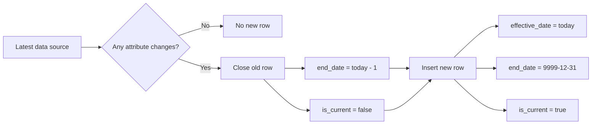

## 1) Project Introduction
Olist, a major online marketplace in Brazil, connects small businesses to customers through various sales channels. As the business grows, Olist faces the challenge of managing and analyzing large volumes of transactional data generated by multiple sellers and diverse customer interactions. To maintain its competitive edge and improve decision-making processes, Olist has identified several key areas where in-depth data analysis is crucial:
1. Customer Satisfaction and Review Analysis
2. Customer Sentiment Clustering
3. Sales Prediction:
4. Delivery Performance Optimization:
To achieve these objectives, Olist needs a data infrastructure that allows them to store, manage, and analyze large volumes of diverse data efficiently. Olist requires a dedicated data warehouse to support advanced analytics and data-driven decision-making.

## 2) Requirements Gathering (Stakeholder Q&A)
Below is a simulation of questions asked during the requirements meeting, along with possible stakeholder answers:

| No | Question | Possible Stakeholder Answer |
|---|---|---|
| 1 | Do changes in customer/seller/product attributes need historical tracking? | Yes, history is needed so trend analysis remains consistent when master data changes. |
| 2 | Which attributes are most critical for customer history? | Customer location (city/state/zip), because it is related to regional performance analysis. |
| 3 | Which attributes are most critical for seller history? | Seller location, because it affects lead time and delivery quality. |
| 4 | Which attributes are most critical for product history? | Product category and dimensions (weight/size) for long-term product performance analysis. |
| 5 | What is the desired grain of fact sales? | One row per order item, so revenue and quantity can be calculated in detail. |
| 6 | What minimum data validation rules are required? | There must be no duplicate current row in SCD dimensions, fact FKs must not be null, and delivery lead time must not be illogically negative. |
| 7 | Is a data mart required? | Yes, ready-to-use aggregate views are needed for daily dashboards, customer summaries, and product performance. |
| 8 | Must the pipeline be idempotent? | Yes, rerunning the same date must be safe and produce a consistent state. |

## 3) SCD Strategy

Selected SCD strategy:

- SCD Type 2 for dim_customer
- SCD Type 2 for dim_product
- SCD Type 2 for dim_seller

Why this strategy was chosen:

- The business needs history of important attribute changes (location and product characteristics).
- Historical analysis must follow the dimension state at the time a transaction happened.
- Type 2 supports longitudinal analytics without losing change history.

SCD columns used in dimensions:

- effective_date
- end_date
- is_current

## 4) Data Model Ringkas
Main schema:

- staging: mirror of source data
- dwh: dimensions + facts

Dimension tables:

- dwh.dim_date
- dwh.dim_location
- dwh.dim_customer (SCD2)
- dwh.dim_product (SCD2)
- dwh.dim_seller (SCD2)

Fact tables:

- dwh.fact_sales
- dwh.fact_delivery
- dwh.fact_review

## 5) ELT Workflow
Pipeline technical flow:

Layer-by-layer explanation:

1. ExtractSource
	- Extract data from PostgreSQL source based on `SRC_*` env variables
	- Save one CSV per table to `artifacts/extract`
	- Save a manifest with row counts per table

2. LoadStaging
	- TRUNCATE all staging tables
	- Load CSV files into staging
	- Use defensive column mapping (extra source columns are ignored if not present in staging)
	- Validate row counts between extract and staging

3. TransformWarehouse
	- Run dimension SQL (including SCD2 close/open logic)
	- Run fact SQL

4. DataQualityCheck
	- Run all SQL checks in `SQL/dq`
	- Each check must return `COUNT = 0`

5. ServeMart
	- Run SQL in `SQL/marts`
	- Create aggregate views for BI needs

6. NotifySuccess
	- Log successful pipeline completion
	- Optionally send webhook if URL is provided

## 6) DQ Rules Implemented
Implemented rules:

- Duplicate current row in dim_customer
- Duplicate current row in dim_product
- Duplicate current row in dim_seller
- Null foreign keys in fact_sales
- Negative delivery lead time

## 7) Mart Layer
Available mart views:

- SQL/marts/01_dm_daily_sales.sql
- SQL/marts/02_dm_customer_summary.sql
- SQL/marts/03_dm_product_performance.sql

Mart goals:

- Provide ready-to-use datasets for dashboards and reporting
- Reduce query complexity on raw fact/dim tables

## 8) Orchestration (Luigi)
Main entrypoint:

- ELTPipeline (wrapper task)

Dependency chain:

- ELTPipeline
- NotifySuccess
- ServeMart
- DataQualityCheck
- TransformWarehouse
- LoadStaging
- ExtractSource

## 9) Cara Menjalankan
### 9.1 Run database (Docker)

Use docker compose from the project root.

### 9.2 Install Python dependencies

Use a virtual environment, then install `requirements.txt`.

### 9.3 Run full pipeline

Example command:

python pipeline.py ELTPipeline --run-date 2026-03-16 --local-scheduler

Or run the final task only:

python pipeline.py NotifySuccess --run-date 2026-03-16 --local-scheduler

