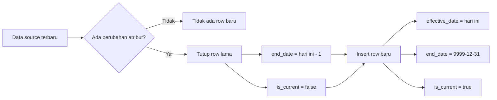
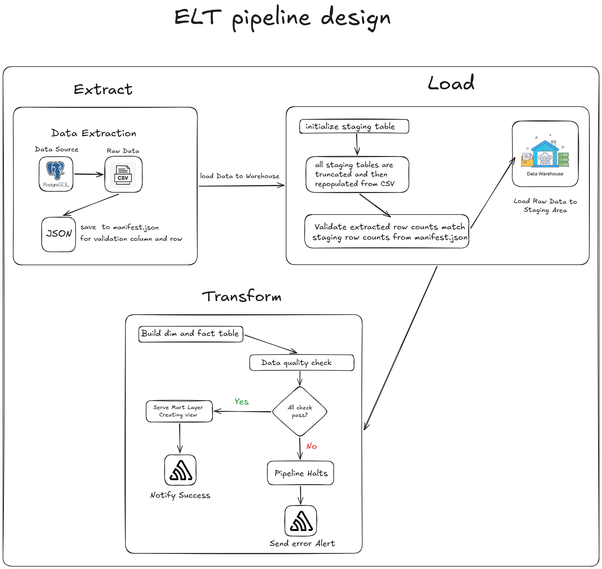

## 1) Project Introduction
Olist, a major online marketplace in Brazil, connects small businesses to customers through various sales channels. As the business grows, Olist faces the challenge of managing and analyzing large volumes of transactional data generated by multiple sellers and diverse customer interactions. To maintain its competitive edge and improve decision-making processes, Olist has identified several key areas where in-depth data analysis is crucial:
1. Customer Satisfaction and Review Analysis
2. Customer Sentiment Clustering
3. Sales Prediction:
4. Delivery Performance Optimization:
To achieve these objectives, Olist needs a data infrastructure that allows them to store, manage, and analyze large volumes of diverse data efficiently. Olist requires a dedicated data warehouse to support advanced analytics and data-driven decision-making.

## 2) Requirements Gathering (Stakeholder Q&A)
Berikut simulasi pertanyaan saat requirement meeting beserta kemungkinan jawaban stakeholder:

| No | Pertanyaan | Kemungkinan Jawaban Stakeholder |
|---|---|---|
| 1 | Apakah perubahan atribut customer/seller/product perlu histori? | Ya, histori perlu agar analisis tren tetap konsisten terhadap perubahan data master. |
| 2 | Atribut mana yang paling kritikal untuk histori customer? | Lokasi customer (city/state/zip) karena terkait analisis performa regional. |
| 3 | Atribut mana yang kritikal untuk histori seller? | Lokasi seller karena memengaruhi lead time dan kualitas pengiriman. |
| 4 | Atribut mana yang kritikal untuk histori product? | Kategori dan dimensi produk (berat/ukuran) untuk analisis performa produk jangka panjang. |
| 5 | Grain fact sales yang diinginkan? | Satu baris per order item agar bisa hitung revenue dan quantity secara detail. |
| 6 | Validasi data minimum apa yang harus ada? | Tidak boleh ada duplicate current row pada SCD dimensi, FK fact tidak boleh null, dan lead time tidak boleh negatif yang tidak logis. |
| 7 | Apakah data mart diperlukan? | Ya, perlu view agregat siap pakai untuk dashboard harian, ringkasan customer, dan performa produk. |
| 8 | Apakah pipeline harus idempotent? | Ya, rerun tanggal yang sama harus aman dan menghasilkan state yang konsisten. |

## 3) SCD Strategy

Strategi SCD yang dipilih:

- SCD Type 2 untuk dim_customer
- SCD Type 2 untuk dim_product
- SCD Type 2 untuk dim_seller

Alasan pemilihan:

- Bisnis membutuhkan histori perubahan atribut penting (lokasi dan karakteristik produk).
- Analisis historis harus mengikuti kondisi dimensi pada saat transaksi terjadi.
- Type 2 mendukung analitik longitudinal tanpa kehilangan jejak perubahan.

Kolom SCD yang digunakan di dimensi:

- effective_date
- end_date
- is_current

## 4) Data Model Ringkas
Schema utama:

- staging: mirror data source
- dwh: dimensi + fakta

Tabel dimensi:

- dwh.dim_date
- dwh.dim_location
- dwh.dim_customer (SCD2)
- dwh.dim_product (SCD2)
- dwh.dim_seller (SCD2)

Tabel fakta:

- dwh.fact_sales
- dwh.fact_delivery
- dwh.fact_review

## 5) ELT Workflow
Alur teknis pipeline:

Penjelasan tiap layer:

1. ExtractSource
	- Ambil data dari source PostgreSQL berdasarkan env SRC_*
	- Simpan CSV per tabel ke artifacts/extract
	- Simpan manifest jumlah baris per tabel

2. LoadStaging
	- TRUNCATE seluruh tabel staging
	- Load CSV ke staging
	- Mapping kolom defensif (kolom ekstra di source diabaikan saat tidak ada di staging)
	- Validasi row count extract vs staging

3. TransformWarehouse
	- Jalankan SQL dimensi (termasuk close/open SCD2)
	- Jalankan SQL fakta

4. DataQualityCheck
	- Menjalankan semua SQL checks pada folder SQL/dq
	- Tiap check harus menghasilkan COUNT = 0

5. ServeMart
	- Jalankan SQL pada folder SQL/marts
	- Membuat view agregasi untuk kebutuhan BI

6. NotifySuccess
	- Logging sukses pipeline
	- Optional kirim webhook bila URL tersedia

## 6) DQ Rules Implemented
Rule yang dijalankan:

- Duplicate current row pada dim_customer
- Duplicate current row pada dim_product
- Duplicate current row pada dim_seller
- Null foreign keys pada fact_sales
- Negative delivery lead time

## 7) Mart Layer
View mart yang tersedia:

- SQL/marts/01_dm_daily_sales.sql
- SQL/marts/02_dm_customer_summary.sql
- SQL/marts/03_dm_product_performance.sql

Tujuan mart:

- Menyediakan dataset siap konsumsi untuk dashboard dan reporting
- Mengurangi kompleksitas query langsung ke fact/dim mentah

## 8) Orchestration (Luigi)
Entrypoint utama:

- ELTPipeline (wrapper task)

Dependency chain:

- ELTPipeline
- NotifySuccess
- ServeMart
- DataQualityCheck
- TransformWarehouse
- LoadStaging
- ExtractSource

## 9) Cara Menjalankan
### 9.1 Jalankan database (Docker)

Gunakan docker compose pada root project.

### 9.2 Install dependency Python

Gunakan virtual environment, lalu install requirements.txt.

### 9.3 Jalankan full pipeline

Contoh command:

python pipeline.py ELTPipeline --run-date 2026-03-16 --local-scheduler

Atau jalankan task terminal saja:

python pipeline.py NotifySuccess --run-date 2026-03-16 --local-scheduler

